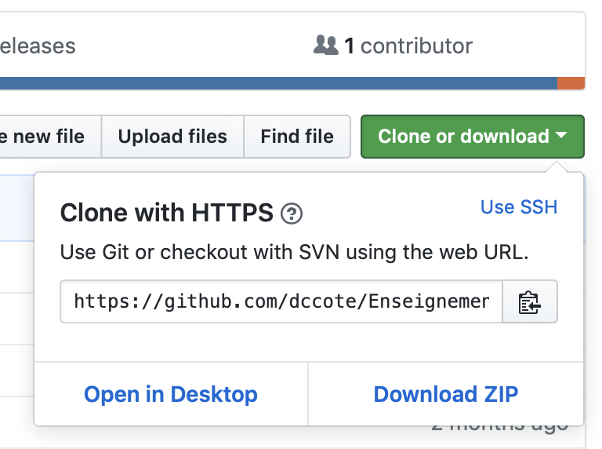
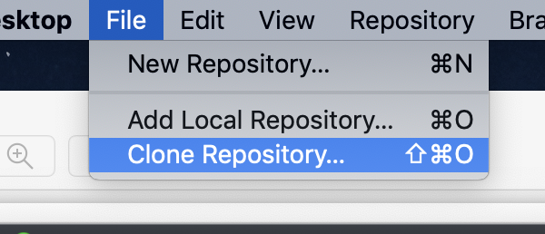
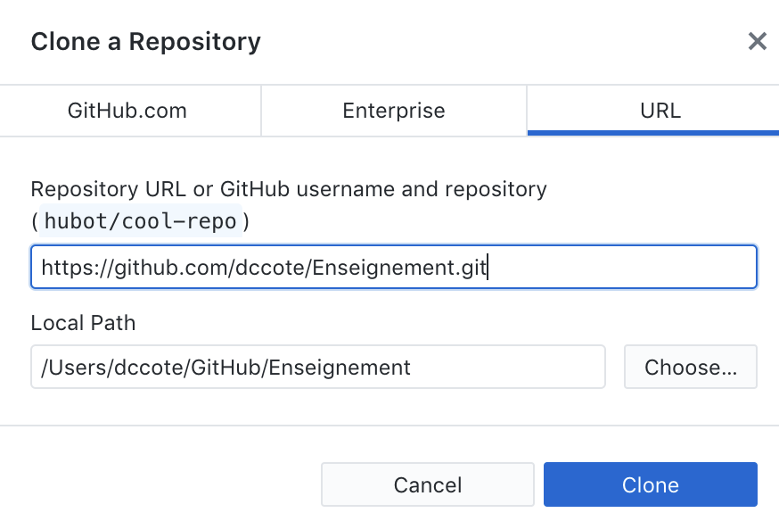
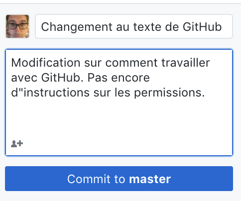

[TOC]

# Les systèmes de version

Le *versioning* est une méthode de travail qui s'exécute à l'aide *d'outils de versioning*. Grâce à ces outils:

1. Plusieurs personnes peuvent travailler sur les mêmes documents en même temps,
2. Un historique des modifications est conservé et permet de retourner l'état des fichiers à un moment particulier,
3. Un système de gestion des modifications est disponible

Il existe plusieurs outils de versioning: `cvs`, ` subversion`,  `perforce`,  `git`. [Pour plusieurs raisons](https://news.ycombinator.com/item?id=17483083), `git` est devenu le standard. Pour faciliter la collaboration, des site web (GitHub, GitLab, GitBucket, etc...) mettent en place un serveur git où les gens peuvent s'inscrire pour conserver le code source.  GitHub est particulièrement bien fait et [est gratuit pour le monde académique](https://help.github.com/articles/applying-for-an-academic-research-discount/). C'est donc le choix qui s'impose aujourd'hui et c'est ce qui sera discuté.

## 1-2-3 Comment ça marche, le *versioning*?

Voici un exemple de journée de travail fait avec un logiciel de versioning dans sa version la plus simplifié:

1. J'ouvre mes outils pour travailler.

2. J'obtiens (*pull*) le code le plus récent de mon projet sur le répertoire (*repository*) du serveur.

3. Je travaille, en plusieurs petites tâches:

   1. À chaque fois que je termine une petite tâche, je commets (*commit*) mon code, c'est-à-dire j'écris l'équivalent d'un cahier de labo:

   > "J'ai complété la tâche 1 qui consistait à ... et les fichiers modifiés sont les suivants."

   3. Je retourne (*push*) l'ensemble de mes modifications dans le répertoire du serveur

4. Si des collègues modifient le code, je demande (*pull*) au serveur les modifications les plus récentes.  Elles seront intégrées (*merged*)  normalement dans mon code sans que je ne fasse rien de particulier, à moins que deux personnes aient modifié exactement les mêmes lignes de code.

5. Lorsque j'ai terminé, tout le monde sur le même projet a accès aux modifications que j'ai fait.

# GitHub

## Je veux travailler sur le code de xyz, qu'est-ce que je fais?

1. Je trouve le code voulu sur GitHub et l'URL pour cloner:

   

2. Dans l'application [GitHub](https://desktop.github.com), je clone: 
   

3. Je copie l'URL voulu et je clique **Clone**:
   

4. Je peux demander a GitHub de m'ouvrir le repertoire sur mon ordinateur:
   

5. Je commence a travailler avec les logiciels appropriés. J'édite les fichiers. Lorsque j'ai terminé, je **Commit** mes changements:
   

6. Si j'ai la permission sur ce **Repository**, je peux envoyer mes modifications (**Push**).

## S'inscrire

1. S'inscrire pour obtenir un compte sur [GitHub.com](https://github.com/join?source=experiment-header-dropdowns-home)

2. Se brancher sur github.com

