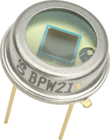
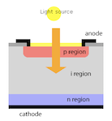

# Détecter et quantifier la lumière

En optique, on doit éventuellement prendre des mesures de lumière pour la caractériser, la quantifier.  Le tableau ce dessous donne une liste de plusieurs types de détecteurs avec leurs caractéristiques générales.

| Nom                             | Vitesse    | Gain      | Réponse | Sensibilité | Bruit intrinsèque                   |
| ------------------------------- | ---------- | --------- | ------- | ----------- | ------------------------------------ |
| Puissance mètre                 | Hz         | 1         | V       | W           | bas                                  |
| Photodiode seule | < kHz        | 1         | mA       | mW       | bas                                  |
| Photodiode (mode photovoltaique) | kHz        | 1         | V       | µW-mW       | bas                                  |
| Photodiode (mode photoconductif) | MHz        | 1         | mV      | nW-µW       | moyen                                |
| Photodiode (mode avalanche) | 10-100 MHz | 50-100    | V       | pW-nW       | moyen                                |
| Tube photomultiplicateur (PMT)  | 10-100 MHz | 1,000,000 | V     | photon      | faible en compte, haut en analogique |
| Solid-state photomultiplier (SSPM) | 5 MHz      | 1,000,000 | V      | photon      | faible-moyen                         |

Ce document a comme but uniquement de discuter des photodiodes, puisque ce sont les détecteurs les plus simples et les plus communs lorsqu'on commence à concevoir des expériences.

# Les photodiodes

## Fonctionnement au niveau microscopique

La photodiode est une structure de semiconducteurs: lorsqu'on illumine la surface du détecteur avec des photons ayant une énergie supérieure à la bande interdite, chaque photon absorbé créera une paire électron-trou dans la partie *intrinsèque*. Parce que le matériel dit *intrinsèque* est en sandwhich entre un semiconducteur de type *donneur* (à charge négative) et un autre de type *accepteur* (à charge positive), il se crée un champ électrique à travers la région *intrinsèque* qui poussera toute charge négative (électron) vers la région *accepteur*  et qui poussera une charge positive (trou) vers la région *donneur*. C'est pour cette raison que les photodiode sont parfois appelées *p-i-n photodiode* ou juste *p-i-n junction* ou vraiment simplement photodiode. La matériel de la région instrinsèque donne son nom à la photodiode: on parle de diode à la silice (Si), arseniure de gallium (GaAs), indium-arseniure de gallium (InGaAs), germanium (Ge). L'énergie de la bande interdite du matériel instrinsèque donne la response spectrale du détecteur: Si (< 1µm), GaAs ( < 850 nm). La photodiode Si est le détecteur le plus utilisé pour la lumière visible car il est sensible est par sa nature, très facile à faire à bas coût, ce qui en fait un photodétecteur de choix.

Ces phénomènes sont entièrement décrits par la physique de l'état solide des semiconducteurs. L'intérêt de ces structures vient de leur utilisation dans un circuit électrique qui en fait un convertisseur de photons en électrons, donc un photodétecteur. Les caractéristiques de la photodétection (réponse en fréquence, force du signal en Volts, etc...) seront données par le reste du circuit.

## Les circuits de photodétection

### Rappel

La diode est un élement qui a comme caractéristique de laisser passer un courant lorsque la tension est *forward-biased* et ne laisse essentiellement pas passer de courant si la tension est dans le sens inverse (*reverse-biased*). Le mot *bias* en anglais se traduit par "la tension aux bornes de quelque chose".

#### Photodiode seule

La photodiode seule génère un courant typiquement de 1 A/W.  Le courant est toujours dans le sens qui donne une diode *forward-biased* (comme sur la figure, le courant passe dans la diode). Si on la branche directement dans un multimètre en mode *ampère-mètre*, on obtiendra une mesure du courant qui correspond directement à la puissance.

Les caractéristiques de ce "circuit" sont très mauvaises:

1. C'est une source de courant, non pas une source de tension
2. Très lent
3. Très non-linéaire car les charges s'accumulent dans la diode

Ce "mode" n'est essentiellement jamais utilisé sauf pour faire des petits [circuits pour enfants](https://www.amazon.ca/Elenco-Snap-Circuits-Jr-SC-100/dp/B00008BFZH/ref=asc_df_B00008BFZH/?tag=googleshopc0c-20&linkCode=df0&hvadid=292929908838&hvpos=1o3&hvnetw=g&hvrand=17551251118043948642&hvpone=&hvptwo=&hvqmt=&hvdev=c&hvdvcmdl=&hvlocint=&hvlocphy=9000255&hvtargid=pla-346177025985&psc=1).

### Photodiode en mode photovoltaïque (meilleur mais difficile)

 ou 

La façon de convertir une source de courant en source de tension est d'utiliser un [amplificateur transimpédance](https://en.wikipedia.org/wiki/Transimpedance_amplifier) comme sur la figure.  Cet amplificateur a un facteur de conversion[^1] de R en V/A (ou bien sûr, en Ω).  Typiquement on retrouvera 10-100 kΩ, et la réponse en fréquence dépendra inversement de cette résistance[^2]. 

Les caractéristiques de ce circuit sont :

1. Se connecte dans un circuit comme une source de tension
2. La diode produit environ 1 A/W, donc on aura environ 0.1V/µW avec 100 kΩ
3. Réponse en fréquence de l'ordre du kHz, au mieux MHz (difficile)
4. Mesure des µW-mW
5. Très peu bruyant
6. Pas de signal résiduel s'il n'y a pas de lumière
7. **Désavantage**: Demande une alimentation (pour l'amplificateur) et un circuit imprimé

### Photodiode en mode photoconductif (rapide et facile)

Une autre façon de convertir une source de courant en source de tension est d'ajouter une tension en mode *reverse-bias* sur la photodiode.  Ceci a pour effet d'augmenter la vitesse à laquelle les charges transitent dans la diode et essentiellement de fournir la tension pour les charges.

Les caractéristiques de ce circuit sont :

1. Se connecte dans un circuit comme une source de tension
2. La diode produit encore environ 1 A/W, donc on aura environ 1V/µW
3. Plus bruyant
4. Courant résiduel donne un signal non nul en permanence
5. **Avantage**: Demande une alimentation mais peut être une batterie, ne demande pas de circuit imprimé très complexe.

### Des exemples

1. Le [DET110A](https://www.thorlabs.com/tutorials.cfm?tabID=31760) de Thorlabs qui est très commun dans les laboratoires de 1er cycle est une photodiode Si avec un circuit de type [photoconductif](https://www.thorlabs.com/tutorials.cfm?tabID=31760), mais la résistance de charge (*load resistor* n'est pas dans le circuit).  On doit donc en fournir une (implicitement comme avec un oscilloscope) ou explicitement (en mettant une résistance entre deux pinces alligators).
2. Parfois, on connecte directement une photodiode directement dans un oscilloscope, avec où sans source de tension. On note que la résistance interne de l'oscilloscope (souvent 1 MΩ ou 10 MΩ) devient la résistance dans laquelle le courant se décharge et fait partie du circuit. 
   
3. Une carte d'acquisition simple (LabJack) qui numérise des signaux avec un *Analog-to-Digital Converter* (ADC) le fait toujours 1) en tension et 2) avec des amplificateurs à l'entrée qui n'accepte aucun courant (leur résistance d'entrée est infiniment grande). Ainsi, on ne peut pas espérer décharger une photodiode directement dans un numériseur: on doit mettre une résistance de charge et mesurer aux bornes de cette résistance. 

[^1]: On ne dit pas d'un amplificateur transimpédenace qu'il a un gain car il n'amplifie pas une tension en une autre tension: il convertit un courant en tension.
[^2]: L'amplificateur est à peu de choses près un filtre passe-bas à cause de la capacitance résiduelle C en parallèle avec la résistance R.  La réponse en fréquence a une coupure de 1/RC.

