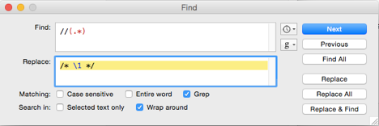

# Les expressions régulières

## Les expressions régulières

Les expressions régulières permettent de reconnaître des patrons dans du texte et d’en extraire l’information. D’une curiosité de programmeur qui a pris racine avec des commandes obscures ```awk``` et ```sed``` de Unix et Linux , mais surtout le langage Perl, elles sont maintenant standardisées et disponibles dans presque tous les langages de programmation. Il s’agit d’un outil puissant pour travailler avec toute forme de texte. Dans le cas du scientifique ou de l'ingénieur, je nomme les situations suivantes:

* Traiter des séries de fichiers de façon générale
* Isoler des dates
* Reconnaitre des chiffres, des nombres, etc...

Par exemple: Vous voulez extraire le nom et prénom d’une personne dans le texte suivant:

```Côté, Daniel```

Vous voulez donc le mot avant la virgule, ensuite, après les espaces, l’autre mot. Vous pourriez lire les caractères un à un, mais qu’arrive-til si vous avez le nom suivant?

```De Koninck, Yves```

L’analyse peut devenir de plus en plus compliquée et tordue. Ainsi, plutôt que de lire les caractères un à un et de faire l’analyse, vous pouvez utiliser les expressions régulières qui ont été inventées justement pour décrire ce genre de patrons. Dans le cas présent, vous pourriez rapidement extraire le nom et prénom avec l’expression régulière suivante:

```\s*(\S.+?),\s*(\S.*?)\s*```

Les parenthèses dans les expression régulières représentent les *matching groups*. Dans notre cas, la première expression entre parenthèses est le nom, la deuxième le prénom, sans les espaces qui peuvent être présents ou non avant ou après le nom. Dans le premier cas, on aurait “Côté” et “Daniel”, alors qu’on aurait “De Koninck” et “Yves” dans le deuxième.

### Le langage de base des expressions régulières

Dans leur forme la plus simple, une expression régulière est une suite de caractères avec un indicatif de répétition. Les parenthèses de capture permettent de garder le texte reconnu. On peut ensuite y référer d’une façon qui dépend de l’outil de programmation utilisé ($1, $2, … dans Perl, \1 \2, … dans la boite “Find” de TexWrangler, etc…).

| Expression | Signification | Expression | Signification |
| ----------------- | ---------------------------- | ---------- | ----------------------------------------------------- |
| . | N'importe quel caractère | * | 0 ou plusieurs fois |
| \s | Espace blanc (ou tabulation) | + | 1 un plusieurs fois |
| \S | Tout sauf un espace blanc | ? | 0 ou 1 fois |
| \d | Un chiffre | {n} | n fois |
| \D | Tout sauf un chiffre | {n,m} | entre n et m fois |
| ^ | Début de ligne | *? | 0 ou plusieurs fois, mais priorité au prochain patron |
| $ | Fin de ligne | () | Parenthèses de capture |
| Lettre ou chiffre | La lettre ou le chiffre | (?:) | Paranthèse de regroupement sans capture |
| \\. | Le point | | |
| \\\\ | Le caractère \\ | | |

### Exemples d’expressions régulières

| Objet recherché | Expression |
| ------------------------------------------------------------ | --------------------------------------------------- |
| Un nom de fichier | ```(.\*?)\\.(...)``` |
| Un nom de fichier avec le chemin complet | ```(.\*?)/(.\*?)\\.(...)``` |
| Une date de la forme AAA-MM-JJ | ```(\\d{4})-(\d\d)-(\d\d)``` |
| Un nom de fichier sous la forme fichier-XXX-YYY-ZZZ.tif ou XXX, YYY et ZZZ sont des chiffres | ```fichier-(\\d{3})-(\\d{3})-(\\d{3})\\.tif{1,2}``` |

## Où trouve-t-on les regexps ?

### MATLAB

Pour obtenir determiner si du texte coorespond a une expression

```matlab
matchStr = regexp(filename, ’fichier-\d\d\d-\d\d\d-\d\d\d\.tif{1,2}’,'match')
```

```matchStr``` aura chaque string qui correspond à l’expression. Pour extraire du texte avec les groupes de capture (i.e. les parenthèses), MATLAB a deux méthodes: par l’ordre ou par nom. Par l’ordre, on fait ceci:

```matlab
[tokens,matches] = regexp(‘stack-001-002-003.tif’,stack-(\d\d\d)-(\d\d\d)-(\d\d\d)\.tif{1,2},’tokens’,’match’);
```

```tokens{1}``` aura le premier groupe de capture et ainsi de suite (dans le cas ici: ‘001’, ‘002’, ‘003’), et ```matches{1}``` aura la chaine de caractères qui a correspondu en premier (dans le cas ici la chaine au complet), ensuite ```matches{2}``` aurait la deuxième s’il y a lieu, etc… L’autre méthode fait appel aux “named tokens”. Ce n’est pas standard regexp, mais MATLAB le fait ainsi:

```matlab
expressionRegexp = ‘(?\d+)/(?\d+)/(?\d+)’
str = '01/11/2000 20-02-2020 03/30/2000 16-04-2020';
expression = ['(?\d+)/(?\d+)/(?\d+)|(?\d+)-(?\d+)-(?\d+)'];
tokenNames = regexp(str,expression,’names');
```

MATLAB retournera un array de structures avec chaque element de la structure identifié par month, day ou year:tokenNames(1).month. Plus d’information, tapez dans la fenêtre de commande de MATLAB:doc regexp

### Les editeurs de texte

La boite Find de BBEdit/TextWrangler/SublimteText/Emacs, permettent de trouver du texte avec des expressions régulières, mais aussi de le remplacer. Par exemple, avec TextWrangler, changer les commentaires dans du texte de C++ à C. Chaque groupe de capture peut être utiliser dans la boîte de remplacement avec \1, \2, \3 etc…:



### Python

Python supporte les expressions régulières. On les utilise comme suit pour extraire les valeurs numériques dans une table de deux colonnes dans un fichier Markdown (par exemple:```| 2.0 | 4.0 |``` mais aussi ```| .02 | 0.01 |```):

```python
matchObj = re.match( "\\|\s*(\.?\d+\.?\d*)\s*\\|\s*(\.?\d+\.?\d*)\s*", line)
if matchObj:
	value = float(matchObj.group(1))
	x.append(value)
	value = float(matchObj.group(2))
	y.append(value)
	continue
```

### Perl

Perl est bâti autour des expressions régulières. On les utilise comme suit:

```perl
if ( $text =~ /(?:+1)?\d{3}?\s*(\d{3}-?\d{4})/ ) {
print “Your phone number without area code is $1”;
}
```

Plus d’information, tapez dans un terminal Unix: ```perldoc perlre```

### Cocoa (iOS ou macOS)

Il existe une classe NSRegularExpression pour faire la reconnaissance de texte. Pour plus d’information, [NSRegularExpression](https://developer.apple.com/documentation/foundation/nsregularexpression) dans XCode.

### Javascript

Les expressions regulières sont supportés directement dans le langage Javascript. Pour plus d’information: <http://www.w3schools.com/jsref/jsref_obj_regexp.asp>

## Mot de la fin

Les expressions régulières sont puissantes et permettent de rapidement vous concentrer sur votre tâche plutôt que de gérer les mondanités ennuyantes des nomenclatures de fichiers, ou les détails d’un texte.

Pour encore plus d’information, “regular expression” dans Google avec le nom de votre langage de choix.